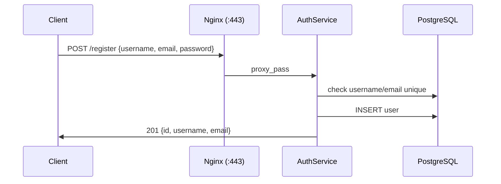
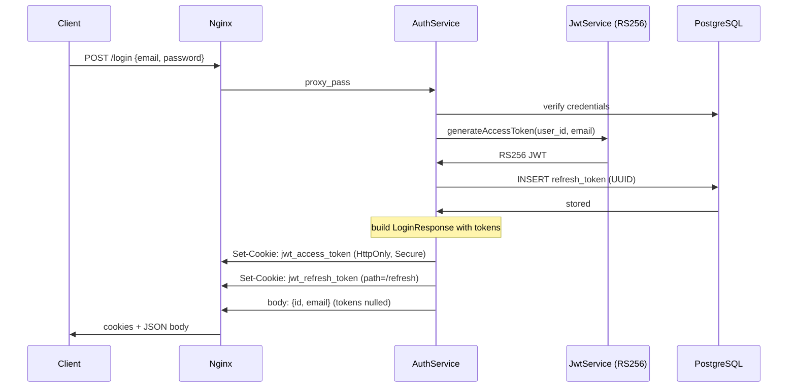
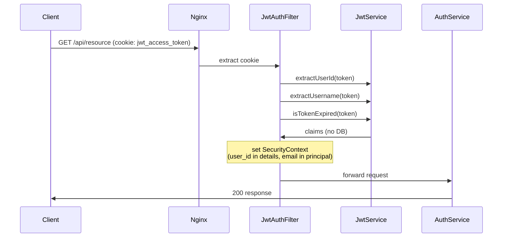
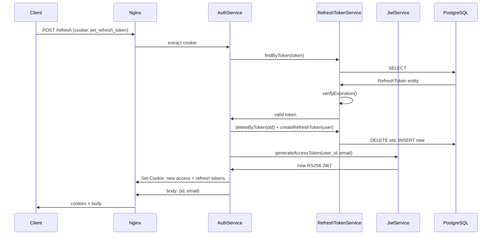
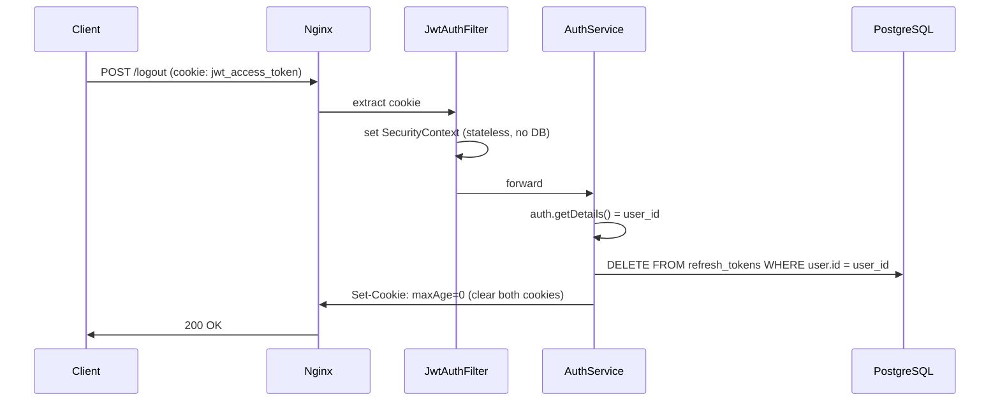

# JWT Authentication System

A stateless, cookie-based authentication microservice built with Spring Boot. Designed as a standalone auth service for a microservice architecture .Other services validate JWTs without database calls.

## Architecture

```
┌──────────────┐  HTTPS (TLS)  ┌────────────┐  HTTP   ┌──────────────┐       ┌──────────┐
│   Browser    │ ────────────▶ │   Nginx    │ ──────▶ │ auth-service │ ────▶ │PostgreSQL│
│              │ ◀──────────── │  (reverse  │ ◀────── │              │ ◀──── │          │
│              │               │   proxy)   │         │              │       │          │
└──────────────┘               └────────────┘         └──────────────┘       └──────────┘
      https://localhost                port 443             port 8080              5432
```

Nginx terminates TLS using mkcert certificates and forwards plain HTTP to the auth service over the internal Docker network. The auth service never handles TLS directly.

### Why cookies instead of localStorage

Tokens are stored in **HTTP-only, SameSite=Strict, secure cookies**. This prevents XSS-based token theft .JavaScript has no access to the cookie. The refresh token is scoped to `/api/auth/refresh` only, so it's never sent to other endpoints.

### Why stateless

Every authenticated request validates the JWT **cryptographically** using the RSA public key. Zero database queries on the hot path. This means:
- The auth service and any downstream service can validate tokens **without calling a database**
- Horizontal scaling is trivial
- Each request is independently verifiable

### Architecture decisions

| Decision | Rationale                                                                                                                                                                              |
|----------|----------------------------------------------------------------------------------------------------------------------------------------------------------------------------------------|
| **JWT access tokens** (15min) | Self-contained, no DB lookup for validation                                                                                                                                            |
| **UUID refresh tokens** (7 days) | Revocable. Stored in DB so we can invalidate on logout                                                                                                                                 |
| **Refresh token rotation** | Each refresh issues a new token and deletes the old one. If a token is stolen and used, the original owner's next refresh will fail (the stolen token was already consumed)            |
| **No Authorization header** | Tokens live only in cookies. The filter never falls back to `Bearer` headers                                                                                                           |
| **Self-validating filter** | The `JwtAuthenticationFilter` parses the JWT and extracts claims (`user_id`, `email`) without touching the DB. The SecurityContext principal is a lightweight object, not a JPA entity |
| **BCrypt strength 12** | Slower hashing for better brute-force resistance                                                                                                                                       |
| **RS256 (RSA) signing** | Asymmetric keys. Other microservices validate tokens with the public key without sharing secrets. Private key never leaves this service                                                |
| **Nginx reverse proxy** | Terminates TLS, separates concerns. The auth service doesn't need to know about certificates                                                                                           |
| **PostgreSQL** | Production-grade persistence for refresh tokens and user data                                                                                                                          |

### Stateless vs stateful endpoints

| Endpoint | DB access | Why |
|----------|-----------|-----|
| `POST /register` | Yes | Must persist user and check uniqueness |
| `POST /login` | Yes | Must load user, verify password, create refresh token |
| `POST /refresh` | Yes | Must look up refresh token in DB (revocable by design) |
| `POST /logout` | Yes | Must delete refresh tokens from DB |
| All other authenticated requests | **No** | JWT is self-validating — zero DB queries |


## Flow diagrams

### 1. Registration



### 2. Login (cookie handshake)



### 3. Authenticated request (stateless)



### 4. Refresh (rotation)



### 5. Logout




## Tech Stack

- **Java 21**
- **Spring Boot 4.x**
- **Spring Security**
- **Spring Data JPA**
- **PostgreSQL**
- **Nginx** (TLS termination, reverse proxy)
- **Docker & Docker Compose**
- **Lombok**
- **JJWT** (Java JWT)

## Getting Started

### Prerequisites

- JDK 21+
- Docker & Docker Compose
- Maven
- [mkcert](https://github.com/FiloSottile/mkcert) (for local HTTPS certificates)

### Running with Docker

1. Clone the repository.

2. Install the local CA and generate TLS certificates for `localhost`:
   ```bash
   mkcert -install
   mkcert -key-file certs/localhost-key.pem -cert-file certs/localhost.pem localhost 127.0.0.1 ::1
   ```

3. Build the application:
   ```bash
   ./mvnw clean package -DskipTests
   ```

4. Copy the environment template:
   ```bash
   cp .env.example .env
   ```

5. Start the services:
   ```bash
   docker compose up --build
   ```

The API will be available at `https://localhost`.

### API Documentation

Once the application is running, access the Swagger UI at:
`https://localhost/swagger-ui.html`

## API Endpoints

| Method | Endpoint | Description | Auth Required |
|--------|----------|-------------|---------------|
| POST | `/api/auth/register` | Register a new user | No |
| POST | `/api/auth/login` | Login and get tokens | No |
| POST | `/api/auth/refresh` | Refresh Access Token (Rotation) | No |
| POST | `/api/auth/logout` | Invalidate Refresh Token | Yes (JWT) |

## Environment Variables

| Variable | Description | Default |
|----------|-------------|---------|
| `JWT_PRIVATE_KEY` | Path to RSA private key (PKCS#8 PEM) | `classpath:keys/private.pem` |
| `JWT_PUBLIC_KEY` | Path to RSA public key (X.509 PEM) | `classpath:keys/public.pem` |
| `DB_URL` | PostgreSQL JDBC URL | `jdbc:postgresql://db:5432/auth_system` |
| `DB_USERNAME` | Database username | `admin` |
| `DB_PASSWORD` | Database password | `password` |

## Security Note

For production, replace the default dev keys with your own:
```bash
openssl genpkey -algorithm RSA -out keys/private.pem -pkeyopt rsa_keygen_bits:4096
openssl pkey -in keys/private.pem -pubout -out keys/public.pem
```

Mount these into the container and set `JWT_PRIVATE_KEY` / `JWT_PUBLIC_KEY` to their paths. Never commit private keys or TLS certificates to version control. The keys in `src/main/resources/keys/` are dev-only defaults.
